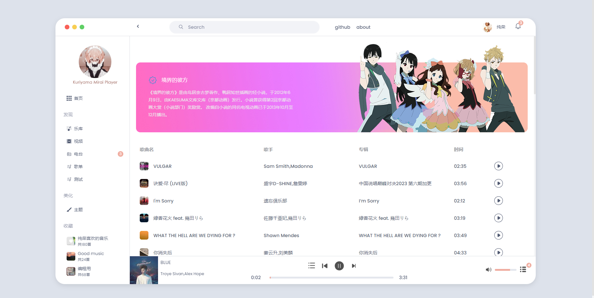
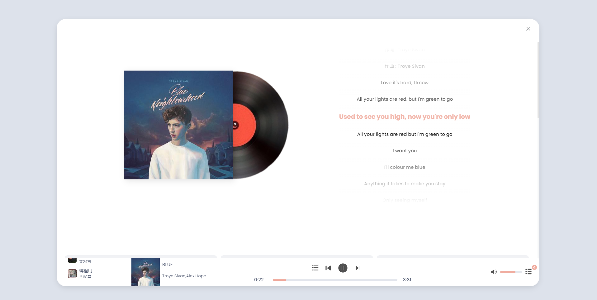
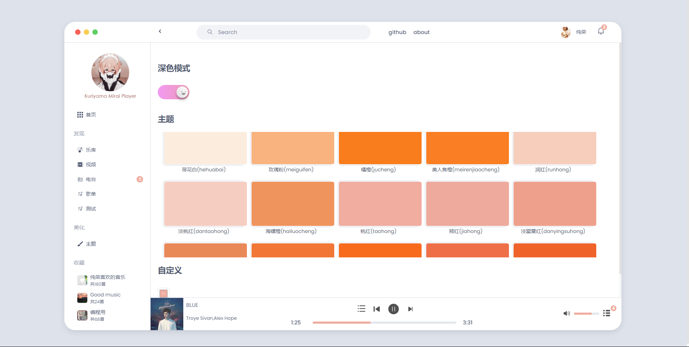
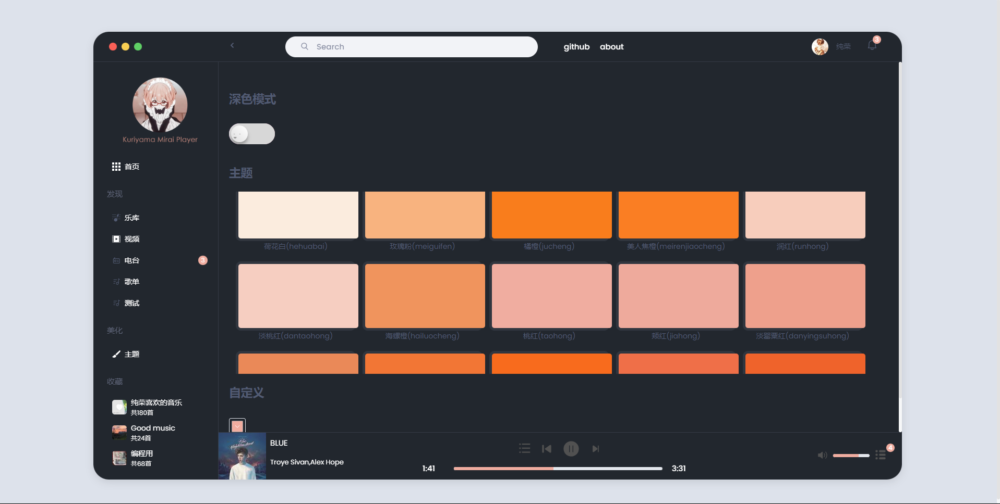

# Kuriyama Mirai Player

### 介绍 📖

Kuriyama Mirai Player 一款基于 Vue3.3、Vite4、Pinia、Element-Plus 开源的Web音乐播放器，使用目前最新技术栈开发。

### 在线预览 👀

vercel：https://kuriyamamiraiplayer.vercel.app/#/ (可能需要魔法)

github pages：https://xiangzi7.github.io/Kuriyama-Mirai-Player/

### 代码仓库 ⭐

GitHub：https://github.com/XiangZi7/Kuriyama-Mirai-Player

项目功能 🔨
使用 Vue3.3 开发，单文件组件＜ script setup ＞
采用 Vite4 作为项目开发、打包工具
使用 Pinia 替代 Vuex，轻量、简单、易用，集成 Pinia 持久化插件
基于 Element Plus
使用 VueRouter 路由懒加载

### 安装使用步骤 📔

* Clone

#Github

`git clone https://github.com/XiangZi7/Kuriyama-Mirai-Player.git`

* Install：
  `yarn`
* Run：
  `yarn dev`
* 文档说明
  https://neteasecloudmusicapi.vercel.app/#/  （可能需魔法上网）

### 项目截图 📷

### 项目后台接口 🧩

* https://neteasecloudmusicapi.vercel.app/#/  （可能需魔法上网）

### QQ交流群 👨‍👨‍👦‍👦

